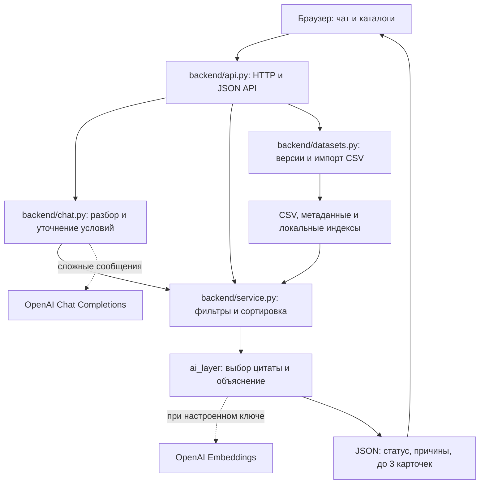

# EVENT-MATCH — подбор подрядчиков для мероприятий

## Краткое описание: проблема и аудитория

При подготовке мероприятия приходится вручную сопоставлять город, дату, бюджет и специализацию подрядчиков. Подходящий по описанию исполнитель может оказаться занят, не работать с нужным форматом или превышать бюджет.

EVENT-MATCH предназначен для организаторов мероприятий, event-агентств и частных заказчиков в Казахстане. Он собирает условия в диалоге, проверяет их по каталогу и объясняет как подходящие варианты, так и отсутствие результата. Итог работы — короткий список для дальнейшего выбора и уточнения условий у подрядчика.

## Что реализовано

- **Диалоговый поиск.** Чат извлекает город, категорию подрядчика, формат мероприятия, дату и бюджет; при необходимости спрашивает недостающие поля. Язык работы и длительность задаются дополнительно. Условия можно менять следующим сообщением.
- **Разбор русского текста.** Поддержаны распространённые сокращения, формы слов и небольшие однозначные опечатки: `алм`, `вед`, `свадба`, `22 окт`, `1,5 млн`. Для сложных сообщений предусмотрен дополнительный AI-разбор.
- **Строгая проверка условий.** Город, категория, занятость, цена «от», формат, язык и длительность проверяются кодом. Календарный фильтр применяется также к площадкам.
- **До трёх карточек с объяснениями.** Каждая содержит код, имя из анонимизированного каталога, категорию, город, цену и проверенные факты с конкретным фрагментом описания. Видны отметки синтетического профиля и полей, заполненных при подготовке данных.
- **Понятные пустые результаты.** Сервис различает отсутствие категории в городе и ситуацию, когда кандидаты есть, но не проходят условия. Во втором случае показывает причины исключения и их количество.
- **Повторяемость и сравнение дат.** При неизменных условиях и каталоге порядок карточек совпадает. При изменении только даты сервис объясняет изменения состава по календарю и правилу сортировки.
- **Загрузка новых CSV.** Есть выбор каталога, проверка данных, отдельные версии и календарные периоды, сохранение после перезапуска и фоновая индексация описаний.
- **Демонстрация в интерфейсе.** Готовые примеры, сравнение 10 и 11 октября, повтор запроса и измерение времени ответа доступны кнопками над чатом.

## Как работает решение

1. Пользователь выбирает каталог и пишет, например: «Корпоратив в Алматы 10 октября 2026, ведущий, бюджет 1500000».
2. Локальный разбор выделяет условия. Если их не удалось собрать полностью или распознать изменение и настроен API-ключ, подключается LLM. Все полученные значения проходят проверку; недостающие условия чат уточняет по одному.
3. Backend выбирает профили нужной категории в городе и исключает занятых на дату, превышающих бюджет или не соответствующих формату, языку и длительности.
4. Подходящие профили сортируются по возрастанию `price_from_kzt`, при равной цене — по `id`. В ответ попадают первые три. Это порядок по стоимости, а не оценка качества исполнителя.
5. Для каждой карточки выбирается содержательный фрагмент её собственного `description`: с помощью эмбеддингов при готовом AI-индексе либо локального поиска по словам. Текст объяснения собирается из проверенных полей и цитаты.
6. Пользователь получает карточки или объяснение отсутствия результата. Сообщение «11 октября» пересчитывает подбор с сохранением остальных условий.

**Роль AI:** извлечение полей из сложного сообщения и семантический поиск фрагментов описаний. Допуск подрядчика, статус ответа и порядок карточек определяет Python-код. Загрузка CSV пополняет базу знаний; веса моделей не дообучаются.

## Технологии

| Часть | Технологии и назначение |
| --- | --- |
| Backend | Python 3.9+, стандартная библиотека: `http.server`, `csv`, `json`, `datetime`, `pathlib`, `threading`, `concurrent.futures`. |
| Frontend | HTML5, CSS, JavaScript и Fetch API; без фреймворка и сборки. Интерфейс и API обслуживаются одним Python-сервером. |
| AI-разбор | OpenAI Chat Completions API; модель по умолчанию — `gpt-4.1-mini-2025-04-14`. Структурированный ответ проверяется по схеме и текстовым подтверждениям из сообщения. |
| Семантический поиск | OpenAI Embeddings API; по умолчанию `text-embedding-3-small`, размерность 256. Поиск фрагментов и сравнение векторов выполняются локально. |
| Хранение | CSV-каталоги, JSON-метаданные и JSON-индексы на локальном диске; отдельная СУБД не требуется. |
| Тестирование | `unittest`, подмены внешних сервисов и локальные HTTP-серверы для интеграционных проверок. |

Сторонние Python-пакеты, Node.js и npm для запуска не нужны. Переменная `NVIDIA_API_KEY` присутствует в образце настроек, но код её не использует.

## Архитектура проекта



Основные файлы и каталоги:

```text
backend/
  api.py             # HTTP-сервер, frontend и маршруты API
  chat.py            # Диалог и извлечение условий запроса
  text_matching.py   # Синонимы, сокращения и небольшие опечатки
  service.py         # Валидация, фильтры, ранжирование, сравнение дат
  catalog.py         # Чтение CSV и проверка профилей
  datasets.py        # Импорт, версии, сохранение и индексация каталогов
ai_layer/            # LLM-разбор, эмбеддинги, поиск цитат, объяснения
frontend/            # index.html и app.js
datasets/            # Исходный CSV и его Markdown-представление
examples/            # Шесть запросов с ожидаемыми результатами
tests/               # Автоматические проверки
docs/                # Контракт, AI-пайплайн и сценарии демонстрации
.env.example         # Образец необязательных AI-настроек
```

Состояние текущего диалога frontend передаёт в API как `slots`. Каталоги изолированы: одинаковые `id` в разных CSV не смешиваются. Индекс исходного каталога хранится в `.cache/`, импортированные данные, метаданные и индексы — в `.local/datasets/`. Эти каталоги и локальный `.env` исключены из Git.

## Установка и запуск

### Локальный запуск без AI-ключа

Потребуются Python **3.9 или новее** и браузер. Git нужен, если проект скачивается командой `git clone`.

1. Скачайте репозиторий и перейдите в его корень. Если проект уже открыт локально, используйте существующую папку:

   ```sh
   git clone https://github.com/BAITC-Hacks/hack-69e35190-team.git
   cd hack-69e35190-team
   ```

2. Проверьте Python:

   ```sh
   python --version
   ```

   В системах, где Python 3 вызывается как `python3`, замените `python` на `python3` во всех командах ниже.

3. Запустите сервер из корня проекта:

   ```sh
   python -m backend.api
   ```

4. Откройте [http://127.0.0.1:8000](http://127.0.0.1:8000). Оставьте терминал с сервером открытым; для остановки нажмите `Ctrl+C`.

Проверка доступности: [GET /health](http://127.0.0.1:8000/health) должен вернуть `{"status": "ok", "catalog_size": 66}` для исходного каталога. Открывайте интерфейс через Python-сервер: файл `frontend/index.html`, открытый напрямую, не подключит API.

Если порт занят, запустите `python -m backend.api --port 8001` и откройте [http://127.0.0.1:8001](http://127.0.0.1:8001). После изменения Python-кода или `.env` перезапустите сервер.

### Подключение AI — необязательно

Создайте в корне файл `.env` по образцу [.env.example](.env.example). Если файл уже существует, обновите нужные значения в нём:

```dotenv
OPENAI_API_KEY=ваш_ключ
AI_EMBEDDING_MODEL=text-embedding-3-small
AI_EMBEDDING_DIMENSIONS=256
AI_CHAT_MODEL=gpt-4.1-mini-2025-04-14
```

Нужны доступ к OpenAI API и интернет. Настройки также можно задавать переменными окружения; они имеют приоритет над `.env`. Ключ остаётся на сервере и не передаётся в браузер.

После перезапуска недостающие индексы строятся в фоне. В разделе «Каталоги и загрузка CSV» доступны статус и кнопка «Построить AI-индекс» для повторной попытки. Состояния: `lexical` — локальный поиск, `indexing` — построение индекса, `ready` — AI-индекс готов, `degraded` — ошибка индексации с сохранением локального подбора.

Индекс исходного каталога можно подготовить отдельно:

```sh
python -m ai_layer prepare-index
```

Эта команда требует API-ключ. Без ключа или при отказе провайдера продолжают работать локальный разбор, фильтры, ранжирование и объяснения по CSV.

## Как проверить решение

### Сценарий для жюри

1. Запустите сервер и откройте интерфейс. В разделе «Каталоги и загрузка CSV» выберите исходный каталог `default`.
2. Нажмите **«Показать три примера»**. В диалоге последовательно появятся:

   | Пример | Ожидаемый результат |
   | --- | --- |
   | Ведущий на корпоратив в Алматы, 10.10.2026, бюджет 1 500 000 ₸ | `matched`: 10 кандидатов, 5 подходят; три карточки в порядке `HK-88430`, `HK-29829`, `HK-27222`. |
   | Флорист на свадьбу в Алматы, 10.10.2026, бюджет 500 000 ₸ | `matched`: 2 кандидата, подходит один — `HK-39372`; второй занят. |
   | Фотограф на корпоратив в Алматы, 25.10.2026, 3 часа, бюджет 50 000 ₸ | `no_matches`: 8 кандидатов, у всех цена выше бюджета; дополнительно 3 заняты и 4 не берут формат. |

3. Нажмите **«Сравнить даты · 10 и 11 октября»**. Для ведущих на 11.10.2026 проходят 4 профиля, а первые три — `HK-44923`, `HK-27222`, `HK-44733`. Интерфейс объяснит, какие профили сменились и почему.
4. Нажмите **«Повторить запрос»**. Порядок кодов карточек должен совпасть с предыдущим результатом. Под ответом отображается измеренное время запроса.
5. Нажмите **«Нет категории в городе»**. Поиск флориста за рубежом вернёт `category_not_in_city` и пустой список карточек.
6. Для проверки уточнений нажмите **«Новый поиск»**, введите «Корпоратив в Алматы 10 октября 2026, бюджет 1500000», затем ответьте «ведущий». Чат сохранит уже распознанные условия и покажет результат первого примера.

Причины исключения могут пересекаться: один профиль бывает одновременно занят и дороже бюджета. Поэтому их сумма не обязана совпадать с количеством исключённых кандидатов. Для времени `15:00` в примере с фотографом появляется предупреждение: календарь учитывает весь день.

### Проверка API

Пример для PowerShell при работающем сервере:

```powershell
$body = @{
    city = 'Алматы'
    event_date = '2026-10-10'
    event_type = 'корпоратив'
    category = 'Ведущий'
    budget_kzt = 1500000
} | ConvertTo-Json

$response = Invoke-RestMethod -Uri 'http://127.0.0.1:8000/recommendations' `
    -Method Post -ContentType 'application/json; charset=utf-8' `
    -Body ([System.Text.Encoding]::UTF8.GetBytes($body))
$response | ConvertTo-Json -Depth 6
```

Ожидаются `status: matched`, `candidate_count: 10`, `eligible_count: 5` и те же три `id`, что в первом примере. Необязательные поля запроса: `language`, `duration_hours`, `dataset_id` (по умолчанию `default`).

| Маршрут | Назначение |
| --- | --- |
| `GET /health` | Проверка работы сервера и размер исходного каталога. |
| `POST /recommendations` | Подбор по структурированным условиям. |
| `POST /chat` | Диалог: `{message, slots?, dataset_id?}`. Возвращает распознанные поля, уточнения и `result`; до заполнения условий `result` равен `null`. |
| `GET /datasets` | Каталоги, их словари, период календаря и статус индекса. |
| `POST /datasets` | Импорт: `{name, csv, calendar_start, calendar_end}`; `csv` передаётся строкой. |
| `POST /datasets/index` | Фоновая индексация выбранного `{dataset_id}`. |

Все три бизнес-статуса (`matched`, `category_not_in_city`, `no_matches`) возвращаются с HTTP 200. Ошибки валидации — HTTP 400; непредвиденная ошибка — JSON с HTTP 500 и `request_id`. При работе через `/chat` передавайте полученные `slots` в следующем запросе и сбрасывайте их при смене каталога.

### Автоматические тесты

Из корня проекта выполните:

```sh
python -m unittest discover -s tests -v
```

На Python 3.12.9 проверено **43 теста — все прошли**. Тесты не требуют API-ключа и не обращаются к внешним сервисам. Они проверяют шесть эталонных сценариев, диалог и опечатки, фильтры, порядок выдачи, принадлежность цитат профилям, импорт и изоляцию каталогов, перезапуск, ошибочные данные, отказ провайдера, сетевые тайм-ауты и обработку HTTP 500. Запись `ERROR` в проверке аварийного ответа ожидаема; итог успешного запуска — `OK`.

Дополнительное демо объяснений: `python -m ai_layer demo`. Оно использует заранее выбранные карточки из эталонных сценариев и проверяет только AI-слой; полный подбор проверяется через интерфейс, API и тесты выше.

## Данные и интеграции

### Исходный каталог

Источник — предоставленный для хакатона анонимизированный [CSV-каталог](datasets/hackathon%20dataset%20anonymized%20.csv). Markdown-файл рядом — представление тех же данных; приложение читает CSV.

| Характеристика | Значение |
| --- | --- |
| Профили и категории | 66 профилей, 17 категорий; один профиль может относиться к нескольким категориям. |
| Города | Алматы — 50 профилей, Астана — 15, «Зарубежье» — 1. |
| Примеры категорий | Ведущие — 15, фотографы — 12, банкетные залы — 8, флористы — 3 по всему каталогу. |
| Цены «от» | От 100 000 до 6 000 000 ₸. |
| Период известного календаря | **23.09.2026–31.12.2026 включительно.** |
| Происхождение полей | 13 синтетических профилей; у 8 профилей город, у 18 цена заполнены при подготовке набора. |

Поля `synthetic`, `city_imputed`, `price_imputed` сохраняются в карточках. `synthetic=false` означает несинтетическую запись исходного набора, а не подтверждённую личность подрядчика.

### Загрузка своего CSV

В разделе «Каталоги и загрузка CSV» укажите название, файл и **полный известный период календаря**, затем нажмите «Загрузить CSV». Новый каталог выбирается автоматически, диалог сбрасывается. Начало и конец периода задаются явно: первая и последняя занятые даты не определяют границы известной доступности.

Формат: UTF-8 (BOM допустим), разделитель столбцов — запятая, списков — `|`, даты — `YYYY-MM-DD`. Нужны столбцы:

```text
id,anon_name,categories,city,price_from_kzt,event_formats,languages,max_hours,busy_dates,description,synthetic,city_imputed,price_imputed
```

Цена — неотрицательное целое число тенге; флаги — `true`/`false` без учёта регистра. Пустой `max_hours` или `null` означает отсутствие ограничения по часам присутствия. Пустой `busy_dates` допустим внутри заявленного периода. Выдуманные профили следует отмечать `synthetic=true`.

Импорт отклоняет дубли `id`, пустые имена и описания, некорректные числа, даты и флаги. Лимиты: **2 000 000 байт на CSV, 5000 профилей в каталоге, 50 каталогов вместе с исходным**. Повторная загрузка идентичного содержимого с тем же периодом использует существующую версию; изменение содержимого или периода создаёт новую. Исходный датасет сохраняется без изменений.

### Внешние сервисы

Единственная реализованная внешняя интеграция — необязательный OpenAI API. При включённом AI в сервис передаются фрагменты описаний и поисковый текст для эмбеддингов, а для сложных сообщений — текст пользователя, текущие условия и словарь каталога. Учитывайте это при выборе данных для загрузки.

Подключений к реальным календарям подрядчиков, CRM, оплате и сервисам бронирования нет. Актуальность подбора определяется выбранным CSV.

## Ограничения текущей версии

- **Локальный прототип.** Нет учётных записей, разграничения доступа, квот и TLS; используется стандартный HTTP-сервер Python. Для публичной эксплуатации требуется отдельная подготовка инфраструктуры и защиты API.
- **Календарь ограничен данными.** Для исходного набора разрешён только период 23.09–31.12.2026. Даты вне известного периода отклоняются. Время начала и пересечения по часам не проверяются.
- **Цена и доступность предварительные.** Фильтр сравнивает бюджет с ценой «от», включая проставленные при подготовке цены. Отсутствие даты в списке занятости не гарантирует возможность заказа. Бронирование и подтверждение стоимости не реализованы.
- **Ранжирование простое.** Учитываются цена и `id`; рейтинги, отзывы, качество работы и персонализация в формулу не входят.
- **Разбор текста не универсален.** Сложную или неоднозначную формулировку может потребоваться уточнить. Распознанные условия отображаются в интерфейсе и доступны для исправления. История диалога после перезагрузки страницы не сохраняется.
- **Импорт требует заданную схему.** Таблицы с другими колонками или из другой предметной области требуют адаптера. Fine-tuning моделей не выполняется.
- **Время ответа зависит от окружения.** Ориентир демо — до 10 секунд. Каждый пользовательский AI-вызов ограничен 3 секундами ожидания с переходом на локальную обработку; это не гарантия сетевого SLA или производительности под нагрузкой.

## Развёрнутая версия

Публичная ссылка на deployed-версию в репозитории **не указана**. Для демонстрации используйте локальный адрес [http://127.0.0.1:8000](http://127.0.0.1:8000) после запуска сервера.

Дополнительные материалы: [контракт и правила подбора](docs/spec.md), [устройство AI-слоя](docs/ai-pipeline.md), [демонстрационные запросы](docs/demo-queries.md), [эталонные JSON-сценарии](examples/demo-cases.json), [история проверки требований](docs/audit.md).
