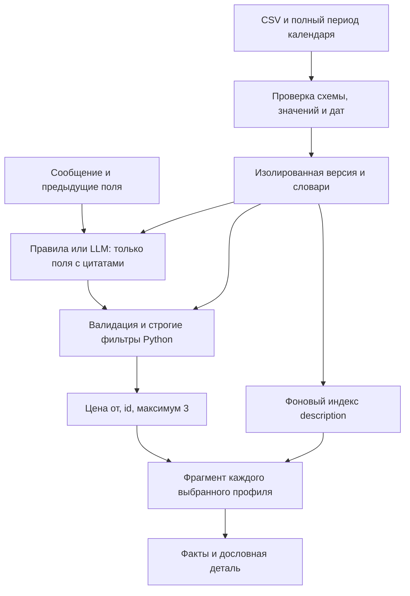
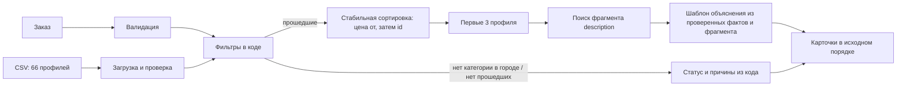

# AI-слой для объяснений подрядчиков

## Дополнение: реализованный диалог и новые CSV

backend/chat.py принимает текст и предыдущие поля. Явные значения извлекаются локальными правилами; для недостающих/непонятых полей ai_layer/intent.py опционально вызывает OpenAI со строгой JSON Schema. Каждое изменение сопровождается дословным фрагментом сообщения; изменения без такого подтверждения отбрасываются. Поля повторно валидируются кодом. LLM не видит кандидатов и не решает, кто подходит. Температура 0 и кэш помогают повторяемости разбора, но гарантия порядка относится к одинаковому структурированному запросу на неизменном каталоге, не к недетерминированной модели.

backend/datasets.py проверяет новый CSV, сохраняет отдельную версию, словари и явно заявленный календарный период, затем строит эмбеддинги в фоне. Поиск до готовности индекса уже работает локально. Сбой индексации не отменяет корректный импорт; UI показывает degraded и позволяет повторить. Импорт не переобучает модель и не объединяет кейсы молча. Каталог выбирается через dataset_id.



Реальные модели по умолчанию: text-embedding-3-small (256 измерений) для описаний, gpt-4.1-mini-2025-04-14 для структурированного разбора. Настройки в .env.example, ключ только на сервере. Вызов на пользовательском запросе ограничен 3 с для каждого из двух этапов; индексация в фоне — 15 с на пакет. NVIDIA не требуется. Документация API: [эмбеддинги](https://developers.openai.com/api/docs/guides/embeddings), [Structured Outputs](https://developers.openai.com/api/docs/guides/structured-outputs), [модель парсера](https://developers.openai.com/api/docs/models/gpt-4.1-mini).

Уточнение формулировок ниже: при пустой выдаче не вызывается **генерация объяснений**, но LLM-разбор текста мог выполняться до фильтрации. Текст карточки всегда собирается кодом, без свободной генерации.

Документ дополняет [контракт сервиса](spec.md). Каталог содержит 66 профилей; это данные для поиска, а не обучающая выборка для дообучения модели. AI-слой отвечает только за выбор подходящего фрагмента `description` и формулировку объяснения. Он не получает права менять список допущенных подрядчиков, их порядок, цену или статус ответа.

## Граница ответственности



Код проверяет город, принадлежность к категории, отсутствие даты в `busy_dates`, цену `price_from_kzt <= budget_kzt`, поддержку `event_type`, язык при его наличии и длительность при числовом `max_hours`. `max_hours=null` означает, что работа не привязана к присутствию, поэтому сравнение часов пропускается. Площадки проходят те же проверки календаря. Код также считает причины исключения и формирует статусы `matched`, `category_not_in_city`, `no_matches`. Эти сведения не выводятся из свободного текста и не определяются моделью.

После фильтрации код сортирует по `(price_from_kzt, id)` и выбирает до трёх карточек. AI-слой вызывается **после** этого шага. При нулевой выдаче AI-вызов не нужен: понятное сообщение с причинами строится из результатов фильтрации.

## Основной вариант: эмбеддинги для выбора фрагмента

Подготовка при загрузке или сборке каталога:

1. Сохранить исходный `description` для цитирования. Разбить на законченные фрагменты по границам предложений, пунктов списка и явных заголовков. Не разрывать скобки, имена и перечисления произвольным лимитом символов. Нормализация пробелов выполняется только для эмбеддинга и отображения цитаты, не меняя исходные смещения.
2. Каждому фрагменту назначить `(profile_id, fragment_index, start, end)`. `description[start:end]` должен в точности воспроизводить текст фрагмента. При выборе исключить рекламные фразы и блоки длиннее 600 символов; если краткой содержательной цитаты нет, использовать проверенные поля с явным предупреждением, без выдумывания особенностей и без обрезания фразы.
3. Один раз вычислить эмбеддинги фрагментов выбранной предобученной моделью и сохранить их с версиями модели, CSV и алгоритма разбиения. Текущий индекс: `schema=2`, `fragmentation_version=3`. Дообучения нет. При изменении любой из этих версий перестроить индекс; до готовности использовать локальный поиск.

Обработка запроса:

1. Из нормализованного запроса составить короткую поисковую фразу: категория + тип мероприятия; при наличии добавить язык и длительность как контекст поиска. Это **не** новый фильтр. Например: `Флорист для свадьбы в Алматы, русский язык`.
2. Получить эмбеддинг фразы. Искать похожие фрагменты **только внутри описания каждой из уже выбранных карточек**, а не по всему каталогу. Для каждого профиля выбрать фрагмент с наибольшим косинусным сходством; равенство разрешать меньшим `fragment_index`. Это предотвращает попадание исключённого профиля через семантический поиск.
3. Проверить, что фрагмент действительно относится к запросу: в нём должна быть содержательная деталь услуги или стиля, подтверждённая исходным текстом. Высокое сходство само по себе не является доказательством. Для начального демо можно требовать пересечение с ключевыми словами формата/категории либо проводить ручную проверку выбранных фрагментов на фиксированных демо-запросах. Если релевантного фрагмента нет, не приписывать профильный стиль — использовать только структурированные факты.
4. Сохранить точную цитату или краткий дословный фрагмент и его смещения во внутреннем результате для проверки. В публичном ответе достаточно 1–2 предложений `explanation` по [спецификации](spec.md).

Поскольку в заказе нет свободного описания желаемого стиля, семантический поиск может выявить соответствие формату мероприятия, но не должен утверждать, что подрядчик подходит по вкусу клиента. Например, фраза профиля о панорамной террасе может отличить конкретный зал; она не доказывает, что клиент хотел панораму.

## Сборка объяснения

Надёжный базовый вариант — детерминированный шаблон. Код формирует проверенные факты:

```text
дата свободна по календарю; формат поддерживается;
цена «от» X ₸ не превышает бюджет Y ₸;
при запросе языка: язык есть в languages;
при запросе часов: max_hours покрывает длительность
  либо max_hours=null и услуга не привязана к присутствию.
```

Из этих фактов выбираются 2–3 наиболее полезных для заказа; затем добавляется выбранная конкретная деталь описания. Результат — 1–2 предложения на русском. Для профиля `HK-39372` при запросе «флорист, свадьба, Алматы, 10 октября, бюджет 500 000 ₸» допустимо: «На 10 октября профиль свободен, берёт свадьбы; цена от 200 000 ₸ укладывается в бюджет. В описании указано авторское цветочное оформление мероприятий в Алматы». При `price_imputed=true` карточка отдельно показывает предупреждение о происхождении цены, как требует спецификация.

Опциональный LLM-вариант: передать модели только нормализованный заказ, проверенные факты **одного** допущенного профиля и список его фрагментов с `fragment_index`. Просить вернуть строгий JSON с выбранным `fragment_index`, без права вводить новые факты. Код проверяет, что индекс существует и принадлежит этому профилю, после чего сам собирает текст шаблоном. Если нужна более естественная формулировка, LLM может вернуть черновик, но публиковать его следует только после проверки чисел, даты, формата, языка, часов и отсутствия новых утверждений; при сомнении использовать шаблон. Модель не должна видеть и «реабилитировать» исключённых кандидатов.

Минимальная инструкция для LLM при выборе фрагмента:

```text
Выбери один fragment_index из предоставленных фрагментов description,
который конкретнее всего объясняет связь профиля с запросом.
Не меняй проверенные поля и не делай выводов о занятости, бюджете,
формате или пригодности. Если подходящего фрагмента нет,
верни {"fragment_index": null}. Ответ только JSON.
```

Этот способ делает результаты модели проверяемыми: публичное объяснение строится из полей CSV и реально существующего фрагмента текста. Если использовать генерацию без такой границы, нужна отдельная проверка на выдуманные сведения, что сложнее обеспечить за время демо.

## Детерминизм, время ответа и отказоустойчивость

- Порядок карточек рассчитывается до AI-слоя и никогда не меняется из-за него. При неизменном каталоге один запрос всегда даёт тот же порядок `id`.
- Индекс фрагментов привязан к хешу CSV, модели, размерности и версии разбиения. Эмбеддинг поисковой фразы кэшируется внутри экземпляра выбранного каталога и модели. При точном равенстве итогового сходства выбирается меньший индекс фрагмента. Текст собирается только шаблоном; режим semantic/lexical может менять цитату, но не набор и порядок карточек.
- Подготовить индекс заранее, а не считать эмбеддинги 66 описаний на каждом запросе. На запрос нужен не более одного эмбеддинга фразы и локальный поиск по максимум трём профилям. Внешний вызов ограничить коротким тайм-аутом; общая цель ответа — до 10 секунд.
- Если модель, индекс или сеть недоступны, выбрать фрагмент простым детерминированным поиском по ключевым словам формата/категории; если не найден — объяснить выбор только структурированными фактами. Сервис всё равно возвращает корректные карточки и статусы.
- Не включать в объяснение обещаний окончательной цены или бронирования. `synthetic`, `city_imputed`, `price_imputed` копируются из CSV в карточку без интерпретации моделью.

## Критерии приёмки AI-слоя

1. На фиксированном запросе порядок `id` совпадает при повторе, при отключённом AI и при работающем AI.
2. Для каждого показанного профиля дата отсутствует в `busy_dates`, цена «от» не превышает бюджет, формат и запрошенный язык поддерживаются, длительность проходит проверку. Ни один из этих выводов не основан на `description`.
3. При удалении имён из трёх карточек плотной категории объяснения содержат разные проверяемые детали профилей, а не одну универсальную фразу. Выбранные фрагменты находятся в соответствующем `description`.
4. Для редкой категории с одной подходящей карточкой сообщение объясняет недостающие две. Для нулевой выдачи AI не вызывается, причины формируются кодом.
5. Два одинаковых запроса на разные даты могут дать разный состав; в карточках указана проверенная дата, а в сообщении — число исключённых по занятости.
6. При недоступности AI результат остаётся валидным и быстрым за счёт локального запасного пути.

## Реализация в репозитории

Модуль `ai_layer/` реализует этот контракт без изменения backend. Точка интеграции: после фильтрации и сортировки вызвать `AIExplainer.enrich_response(order, response)`, где `order` — словарь запроса из [spec.md](spec.md), а `response` — словарь ответа с уже готовыми `cards`. Возвращается копия ответа; меняется только `explanation` в каждой карточке. Перед составлением объяснения модуль сверяет профиль с CSV и отклоняет ошибочно переданную карточку, которая не проходит дату, бюджет, формат, город, язык или часы.

В режиме без ключа работает локальный выбор фрагмента. Для семантического поиска заполнить `OPENAI_API_KEY` в локальном `.env` и один раз выполнить `python3 -m ai_layer prepare-index`. Индекс сохраняется в `.cache/`, привязан к хешу CSV, модели и размерности. Во время пользовательского запроса индекс не перестраивается: при наличии ключа и готового индекса выполняется один короткий API-вызов для эмбеддинга поисковой фразы, а при ошибке применяется локальный выбор. Ключ и индекс не включаются в Git.

`python3 -m ai_layer demo` показывает только работу объяснений на уже выбранных `id` из `examples/demo-cases.json`; фильтрацию выполняет backend команды. API-ключ для локального режима не нужен. Тесты: `python3 -m unittest discover -s tests -v`.
